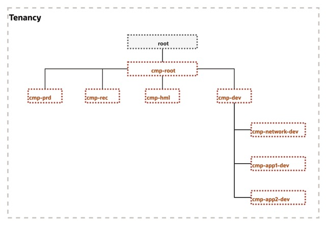

# OCI Setup Script

This script automates the creation of OCI compartments, VCNs, subnets, groups ... based on a provided configuration and data file, following this hiearchy :



## Usage

```bash
./script.sh --config CONFIG_FILE --data DATA_FILE
```

### Arguments

- --config CONFIG_FILE: Path to the configuration file.

- --data DATA_FILE: Path to the data file.

### Example

```bash
./script.sh --config var.config --data app_list.csv
```


## Notes

Ensure the OCI CLI is installed and configured with the appropriate credentials before running the script.